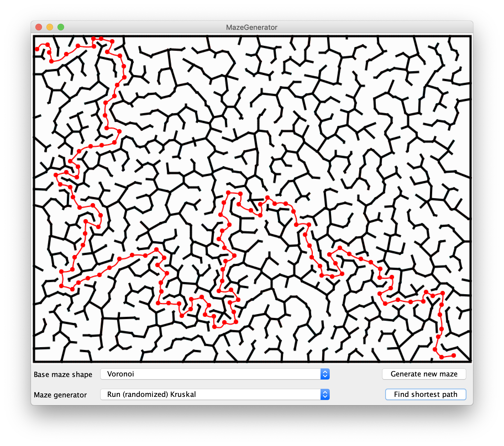

This project generates and solves mazes:

The mazes are generated from a initial grid by means of Kruskal's algorithm: a minimum spanning tree of a densly connected grid of polygons gives a valid maze. The maze is then solved by a straight-forward application of Djikstra's algorithm. We search for the shortest path between two points on a single graph component.

Known issues;

1) When finding the minimum spanning tree in Graph.findMinimumSpanningTree(), I do not give edges random weights. This means the same mst is generated everytime, which is undesirable. I am not sure how to set the weights on these Wall objects, because they are handed into this method as arguments, and they do not have any 'resetWeight()' method. Additionally, I tried to create new wall objects, but not all the fields in the original wall objects are accessible. 

2) Finding paths through very sparse graphs is very slow and I am not able to do it. This could be because I have written a sub-optimal version dijkstra's algorithm. But, it might also be because there IS no traverse of the graph, because the intersections are really the walls.

